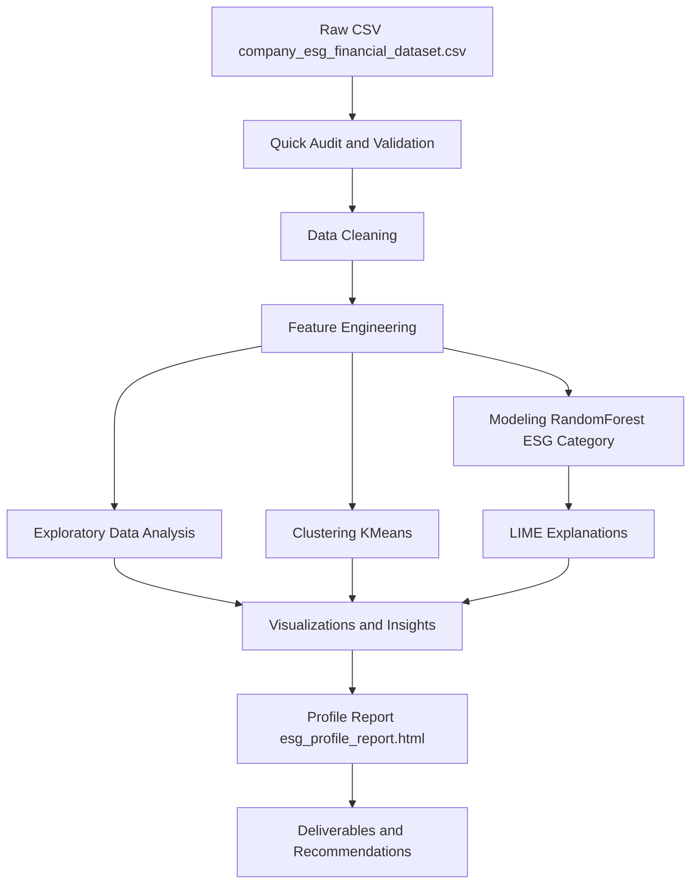
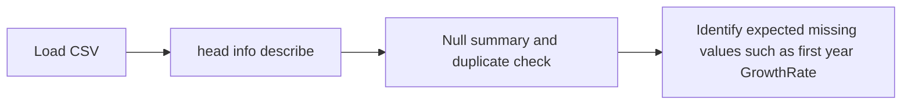
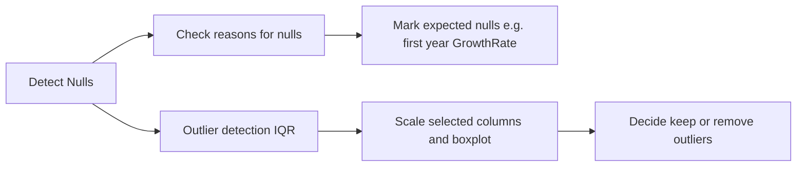
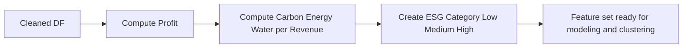
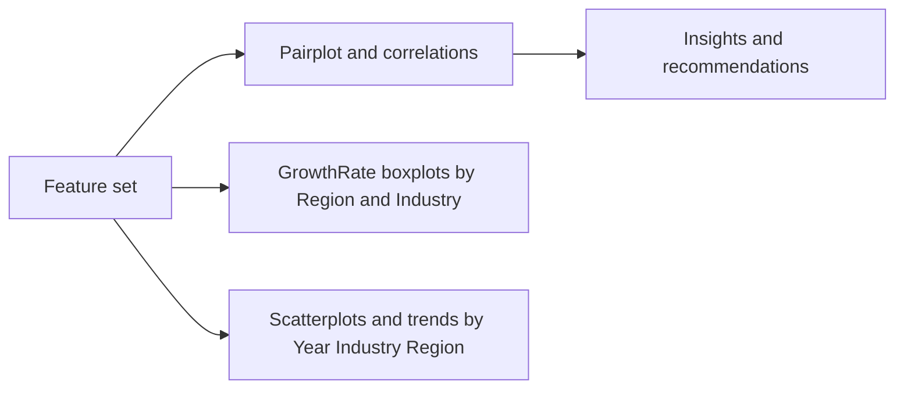
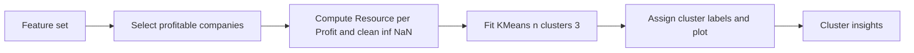
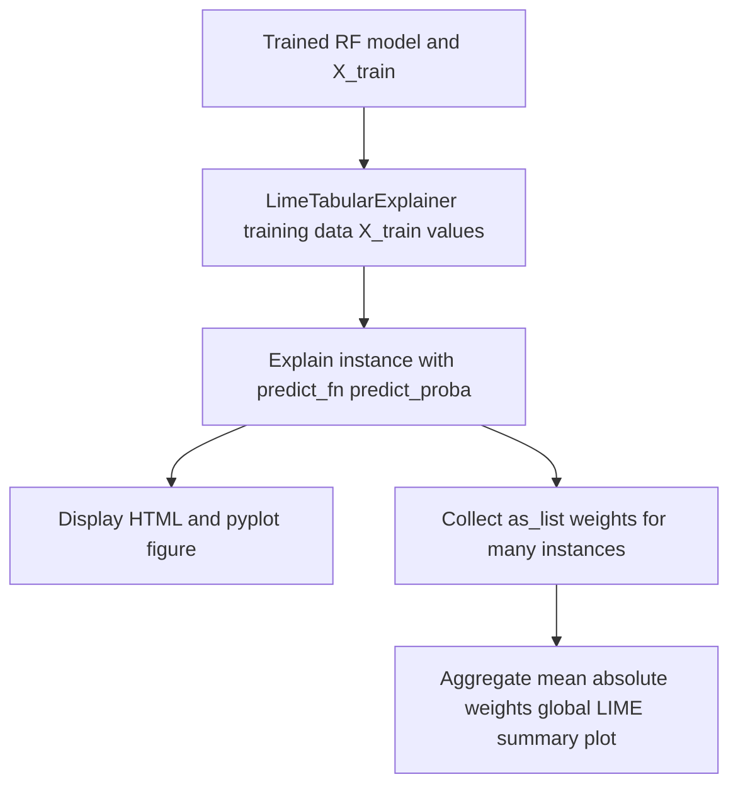

# ESG & Financial Performance — Advanced Analysis

# Project members and Roll numbers

- Prateek Kumar Prasad -(2301420018)-Btech CSE DS Sem V
- Yatharth Chopra -(2301420022)-Btech CSE DS Sem V


This repository contains a Jupyter Notebook `ESG_&_Financial_Performance_Dataset_V4.ipynb` that performs an end-to-end exploratory data analysis (EDA), feature engineering, modeling, and local explainability (LIME) on a synthetic/company ESG and financial dataset. The notebook is organized into numbered sections; this README summarizes the pipeline, reproduces key commands, documents artifacts, and provides Mermaid.js flowcharts that describe the architecture and data flows.

---
## Working dashboard 


## High-level goals / contract
- Input: `company_esg_financial_dataset.csv` — tabular dataset containing company ESG metrics (Environmental, Social, Governance pillars), resource usage (Energy, Water, Carbon), and financials (Revenue, ProfitMargin, MarketCap, GrowthRate, Year, Industry, Region, etc.).
- Output: EDA visuals, feature-engineered dataset, trained Random Forest classifier for ESG category, LIME-based local explanations, KMeans clustering results, and an HTML profiling report `esg_profile_report.html`.
- Success criteria: Notebook runs end-to-end without errors on a reasonable machine (8GB+ RAM suggested). Visualizations render in the notebook and the classifier trains and returns non-trivial accuracy.

## Table of contents
1. Quick data audit and validation
2. Data cleaning and outlier checks
3. Feature engineering
4. Exploratory Data Analysis (questions & visualizations)
5. Clustering and segmentation (KMeans)
6. Modeling for ESG Category (RandomForest)
7. Local explainability (LIME)
8. Profiling and reporting (ydata_profiling)
9. Artifacts & reproducibility
10. Next steps & caveats

---

## Overall pipeline (Mermaid)

Below is an overall pipeline flow showing the major processing steps. Paste this block into any Markdown renderer that supports Mermaid (GitHub, VS Code + Mermaid extension, or Mermaid Live Editor).



Notes:
- The pipeline is linear for EDA and modeling but branches for clustering and explainability which are parallel analyses on the feature-engineered data.

---

## Detailed step-by-step with Mermaid sub-flows

### 1) Quick Data Audit & Validation
- Load CSV into pandas: `pd.read_csv("company_esg_financial_dataset.csv")`
- Inspect shape, dtypes, head, describe, null counts and duplicates.

Mermaid flow for audit:


### 2) Data Cleaning & Outlier Detection
- Nulls: `df.isnull().sum()` and inspection of rows where `GrowthRate` is null to confirm first-year origin.
- Outliers: IQR method computed per numeric column, and StandardScaler used to visualize boxplots for comparability.

Mermaid flow:


### 3) Feature Engineering
- New columns added:
  - `Profit = Revenue * (ProfitMargin/100)`
  - `Carbon_per_Revenue = CarbonEmissions / Revenue`
  - `Energy_per_Revenue = EnergyConsumption / Revenue`
  - `Water_per_Revenue = WaterUsage / Revenue`
  - `ESG_Category = pd.cut(ESG_Overall, bins=[0,40,70,100], labels=["Low","Medium","High"])`

Mermaid flow:


### 4) Exploratory Data Analysis (EDA)
- Pairplots and correlation tables for Energy, Water, Carbon vs Profit/Revenue.
- Boxplots for GrowthRate by Region & Industry.
- Scatterplots for ESG_Overall vs ProfitMargin and Carbon_per_Revenue vs ESG_Environmental.

Mermaid flow:


### 5) Clustering (KMeans segmentation)
- Prepare df_cluster with profitable companies: `df[df['Profit'] > 0]`.
- Create `Resource_per_Profit` = ResourceIntensity/Profit and handle inf/NaN.
- Fit KMeans(n_clusters=3).
- Plot clusters on log x-axis for Resource_per_Profit vs Profit.

Mermaid flow:


### 6) Modeling: RandomForest for ESG_Category
- Encode `ESG_Category` with LabelEncoder.
- Train/test split (80/20) and RandomForestClassifier(n_estimators=100, random_state=42).
- Print training and testing accuracies.

Mermaid flow:


### 7) Local explainability (LIME)
- Create LIME explainer with training data and same feature order.
- Explain single instances and multiple instances (the notebook provides an instance loop and summary across multiple explanations to compute average absolute LIME weights).
- Display as HTML table where available and also as Matplotlib figures via `as_pyplot_figure()`.

Mermaid flow (LIME local and aggregate):


Notes on LIME usage and gotchas:
- Ensure `predict_fn` accepts 2D numpy arrays and returns class probabilities; LIME will pass a numpy 2D array.
- Ensure feature order passed to LIME matches the model input order exactly.
- For categorical features used, supply categorical_features and categorical_names when constructing LimeTabularExplainer (not used in this notebook because features are numeric after cleaning).
- LIME is computationally expensive; explaining many instances (e.g., 50) can be slow.

---

## Reproducibility & recommended environment
Minimum recommended Python environment:

- Python 3.8+ (3.10 recommended)
- RAM: 8GB+

Recommended pip install:

```powershell
pip install -r requirements.txt
```

Sample `requirements.txt` (if you want to create it):
```
pandas
numpy
matplotlib
seaborn
scikit-learn
lime
ydata_profiling
ipywidgets

# optional
jupyterlab
```

Quick one-off installs used in the notebook (already present):
```powershell
pip install pandas matplotlib seaborn scikit-learn lime ydata_profiling ipywidgets
pip install --upgrade setuptools
```

---

## How to run (notebook)
1. Open `ESG_&_Financial_Performance_Dataset_V4.ipynb` in Jupyter or VS Code.
2. Ensure the dataset `company_esg_financial_dataset.csv` is in the same folder (or update the path in the notebook cell that loads the CSV).
3. Run the cells sequentially. If you hit long-running steps (profiling or running LIME many times), interrupt and try a smaller sample size.

Tip: If the profiling report consumes too much memory, use a sample: `ProfileReport(df.sample(2000), explorative=True)`.

---

## Artifacts produced by the notebook
- `esg_profile_report.html` — a full profiling HTML report.
- Plots rendered inline (pairplots, boxplots, scatterplots, LIME figures, cluster plots).
- `ESG_Category` classifier (RandomForest) trained in-memory; you can persist with joblib if desired.
- Aggregated LIME importance plot (created in the notebook as a Matplotlib bar chart).

---

## Code snippets & common troubleshooting
- LIME predict function wrapper (if your model's API differs):
```python
# Ensure predict_fn accepts 2D array and returns predict_proba
def wrapped_predict_proba(x_arr):
    # x_arr is numpy array of shape (n_samples, n_features)
    # If your pipeline needs a DataFrame with columns, re-create it here:
    X_df = pd.DataFrame(x_arr, columns=feature_cols)
    return rf_model.predict_proba(X_df)
```

- If LIME's feature labels include extra text like "<feature> <= 5000.0", mapping names back to raw feature columns (noted in the notebook) is done by simple substring checks.

---

## Next steps & improvements
- We will Add persistence: save trained RF model and scaler with `joblib.dump` so LIME explanations can be re-run without re-training.
- Will add cross-validation and hyperparameter search for the RandomForest to improve generalization.
- Will use SHAP for faster and more consistent global explanations (and dependence plots).
- Add  more unit tests for data validation steps and a small integration test that runs the notebook pipeline on a tiny sample.

---
## Working dashboard 


# After the Drop down Implented by respective feild
  


# After Filter
   


